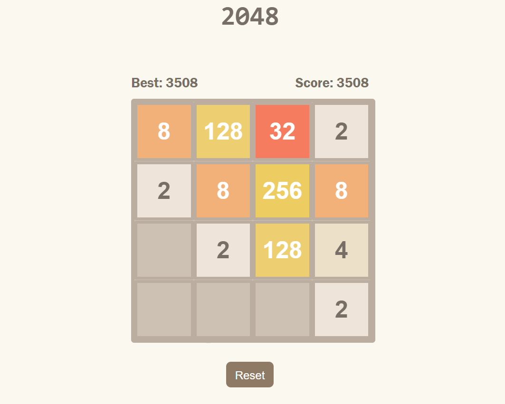
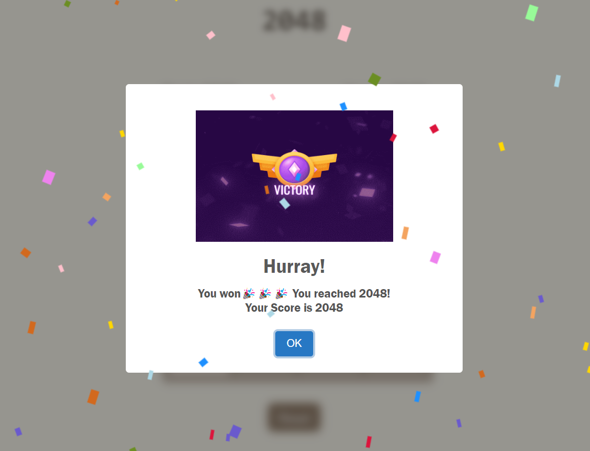

# 🎮 2048 Game

## 📝 Introduction
Welcome to the **2048 Game**! This is a simple and fun puzzle game where the objective is to slide numbered tiles on a grid to combine them and create a tile with the number **2048**. The game is built using **HTML, CSS, and JavaScript** and can be played directly in the browser.

## 🚀 Play
Click Here and Enjoy: https://hetbhalani.github.io/2048/

## 📸 Screenshots

## 🎯 How to Play

**Objective:** Combine the tiles to reach the **2048** tile.

**Controls:** Use the arrow keys ⬆️⬇️⬅️➡️ to slide the tiles.

**🧩 Rules:**
- Each move adds a new tile with a value of **2️⃣** to the grid.
- The game ends when no more moves are possible.

## ✨ Features

- **Responsive Design:** The game is designed to be played on both desktop and mobile devices.
- **Score Tracking:** The game keeps track of your score, which increases as you combine tiles.
- **Game Persistence:** Your progress is saved in local storage, so you can resume your game even after closing the browser.

## 🛠️ Technologies Used

- **HTML:** The structure of the game is built using **HTML**.
- **CSS:** Custom styling is applied with **CSS** to create a visually appealing interface.
- **JavaScript:** The game logic, including tile movement, merging, and score tracking, is implemented in **JavaScript** .

## 🤝 Contribution

If you'd like to contribute to the development of this game, feel free to submit a pull request 🛠️ or report an issue on GitHub.
